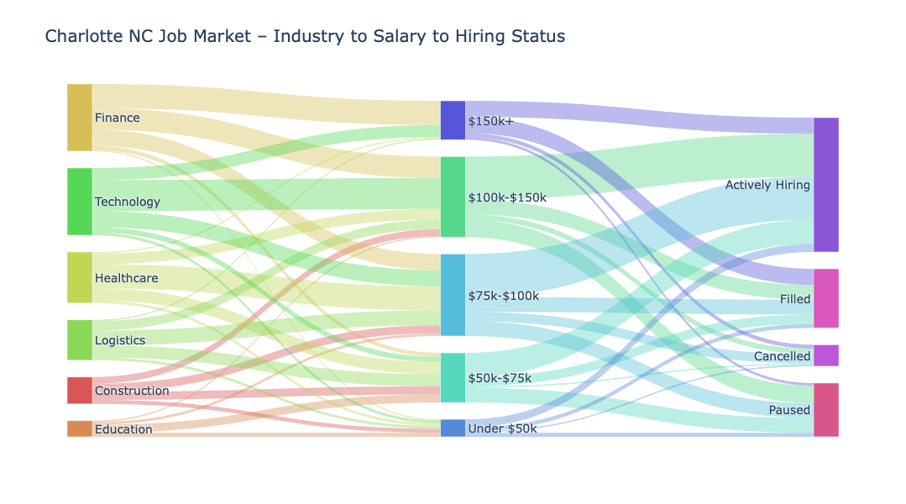

# Python Sankey Chart Generator

A self-service Python tool for transforming structured Excel data into interactive Sankey diagrams.

## Overview

This tool simplifies the process of creating Sankey visualizations from tabular data. Users can provide an Excel or CSV file path, select the columns representing the source, target, and flow values, and generate an interactive Sankey diagram without manually writing visualization code.

The project was built to make flow-based data visualization more accessible for users who may not work directly with Python or Plotly.

## Example Output



## Features

* Excel and CSV data input
* User-selected source, target, and value columns
* Data processing with Pandas
* Interactive Sankey visualizations with Plotly
* HTML output for easy sharing and exploration
* Self-service workflow designed to minimize manual coding

## Technologies

* Python
* Pandas
* Plotly
* Excel
* HTML

## Workflow

```text
Excel Data
    ↓
Column Selection
    ↓
Pandas Data Processing
    ↓
Sankey Diagram Generation
    ↓
Interactive HTML Output
```

## Example Use Case

The tool can be used to visualize flows between categories, stages, systems, teams, or other connected entities.

For example:

```text
Source → Target → Value
```

can be transformed into an interactive Sankey diagram showing the magnitude of movement between each source and target.

## Project Purpose

This project demonstrates the use of Python for data transformation, visualization, and self-service analytics. It combines data processing and interactive visualization into a workflow that can be used by non-technical users.

## Future Improvements

Potential future enhancements include:

* Drag-and-drop file uploads
* Additional visualization customization
* Export options
* Validation for inconsistent or missing data
* Additional flow visualization formats

## Author

Dana Kozan

MS Data Science | Data & Technical Project Analyst | Python | Data Visualization | Cross-Functional Delivery
